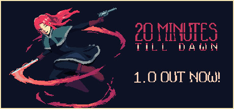

## 20 Minutes Till Dawn Ultra-Wide Fix

 

 

## Features
- Overrides fullscreen to the main display resolution and enforces the appropriate aspect ratio.
- Adds all available resolutions to the windowed mode picker.

## Notes
- The Fog of War circle at 21:9 is increased in scale just slightly to fill the edges. At super-wide, there may be a gap on the edges of the screen.
- The UI/hud is tied to the aspect ratio, which is fine for 21:9. Anything wider will be like watching tennis.

## Installation
- Extract the contents of the release zip into the game directory. (e.g. "**steamapps\common\20MinuteTillDawn**" for Steam).
