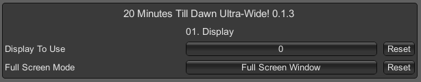

### 20 Minutes Till Dawn Ultra-Wide

 

 

Tested against retail Steam version @ 3440x1440.

## Features
- Overrides fullscreen to the main display resolution and enforces the appropriate aspect ratio.
- Resolution and fullscreen mode picker are disabled in the settings menu. Borderless fullscreen is forced.
- UI corrections, mostly related to the main menu, weapon selection screen and the fog in-game.

## Configuration
- Press F1 in game to open the UI.

 

## Installation
- Grab the latest release from [here](https://github.com/p1xel8ted/UltrawideFixes/releases/tag/DeathMustDie).
- Extract the contents of the release zip into the game directory. (e.g. **`steamapps\common\Death Must Die`** for Steam on Windows).

## Changes

`0.1.2` - 2nd April 2024
- Fog scaling is dynamically adjusted based on the resolution instead of being a hard-coded value.
- Character portraits are now positioned dynamically based on the resolution instead of being a hard-coded value.
- The advertisement banner on the main menu is disabled.

`0.1.1` - 6th August 2023
- Fixed the character portrait overlaying weapons on the weapon selection screen.

`0.1.0` - ??
- Initial release.

## Credits
- [Bepis](https://github.com/bbepis) and team for [BepInEx](https://github.com/BepInEx/BepInEx).
- [ManlyMarco](https://github.com/ManlyMarco) for [ConfigurationManager](https://github.com/BepInEx/BepInEx.ConfigurationManager).
- [Sinai]() for [Unity Explorer](https://github.com/sinai-dev/UnityExplorer).