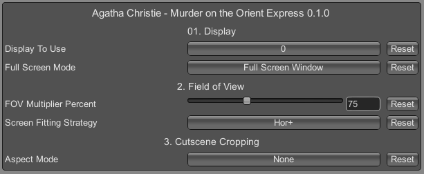

# Agatha Christie - Murder on the Orient Express

 

Tested against retail Steam version @ 3440x1440.

## Features
- Pillar-boxing has been removed and cutscene aspects corrected.
- Option to change the third-person field of view.
- Option to change the screen-mode (fullscreen, windowed etc) and the display the game uses.

## Configuration
- Press F1 in game to open the UI.

 

## Installation
- Grab the latest release from [here](https://github.com/p1xel8ted/UltrawideFixes/releases/tag/AgathaChristieMOE). Windows and MacOS/Unix versions have been made available.
- Extract the contents of the release zip into the game directory. (e.g. **`steamapps\common\Agatha Christie - Murder on the Orient Express`** for Steam on Windows).

## Changes

`0.1.1` - 3rd April 2024
- Implemented field of view adjustments.
- Implemented configurable screen mode.
- General clean up and code improvements.

`0.1.0` - 24th October 2023
- Initial release.

## Support

   

## Credits
- [Bepis](https://github.com/bbepis) and team for [BepInEx](https://github.com/BepInEx/BepInEx).
- [ManlyMarco](https://github.com/ManlyMarco) for [ConfigurationManager](https://github.com/BepInEx/BepInEx.ConfigurationManager).
- [Sinai]() for [Unity Explorer](https://github.com/sinai-dev/UnityExplorer).
