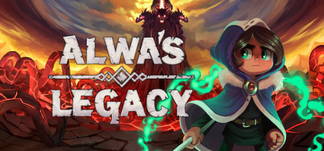

### Alwa's Legacy Ultra-wide Fix
 

 

## Features
- Allows selection of main display resolution in the in-game resolution list.
- Removes pillarboxing.
- Skips intros.
- Adjust dialogue scale.

## Note
- Doesn't scale loading screens/main menu. The gameplay is fine.
- Background sprites are cooked.

## Installation
- Extract the contents of the release zip into the game directory. (e.g. "**steamapps\common\Alwa's Legacy**" for Steam).

## Configuration
- HorizontalScrollAdjustment = Change when the game initiates a scroll. The current setting will scroll when the player is within 300 pixels of the left/right edge of the screen. This setting allows you to adjust that value.
- DialogScale = Scale of the NPC dialogues and item pickup dialogues. 0.75 is the default (which makes it a little smaller).
