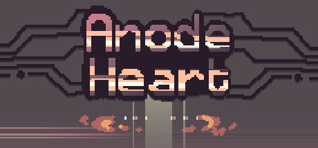

### Anode Heart Ultra-Wide

 

 

Tested against retail Steam version @ 3440x1440.

## Features
- Adds your main display resolution to the in-game options menu.
- Corrects UI scaling to match your 16:9 equivalent. (e.g. 2560x1080 = 1920x1080).
- Adjustable zoom level. You will see things you are not supposed to see when zooming out too far.

## Configuration
- Press F1 in game to open the UI.

## Installation
- Grab the latest release from [here](https://github.com/p1xel8ted/UltrawideFixes/releases/tag/AnodeHeart).
- Extract the contents of the release zip into the game directory. (e.g. **`steamapps\common\AnodeHeart`** for Steam).

## Credits
- [Bepis](https://github.com/bbepis) and team for [BepInEx](https://github.com/BepInEx/BepInEx).
- [ManlyMarco](https://github.com/ManlyMarco) for [ConfigurationManager](https://github.com/BepInEx/BepInEx.ConfigurationManager).
- [Sinai]() for [Unity Explorer](https://github.com/sinai-dev/UnityExplorer).
