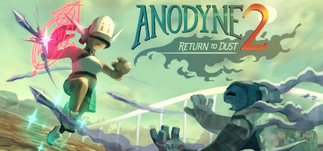

### Anodyne 2 Ultra-Wide

 

 

Tested against retail Steam version @ 3440x1440 & 3840x1080

## Features
- Added main display resolution to the in-game resolution list.
- Skips intros.
- Removes extra menu clutter.
- Implemented fixes to remove the black bars.
- Fixed the game settings not saving if you didn't have a save game loaded (saves and restores from registry using Unity's PlayerPrefs.

## Notes
- The 2D elements of the game have an overlay; removing this overlay does not expand the game area.

## Configuration
- None

## Installation
- Grab the latest release from [here](https://github.com/p1xel8ted/UltrawideFixes/releases/tag/Anodyne2).
- Extract the contents of the release zip into the game directory. (e.g. **`steamapps\common\Anodyne 2`** for Steam).

## Credits
- [Bepis](https://github.com/bbepis) and team for [BepInEx](https://github.com/BepInEx/BepInEx).
- [ManlyMarco](https://github.com/ManlyMarco) for [ConfigurationManager](https://github.com/BepInEx/BepInEx.ConfigurationManager).
- [Sinai]() for [Unity Explorer](https://github.com/sinai-dev/UnityExplorer).