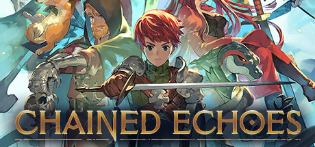

### Chained Echos Ultrawide UI Adjustments (3440x1440 only)
 

 

## Features
- Modifies certain UI elements, mainly backgrounds, to cover the entire screen, not the 16:9 portion.

## Note
- This was made for personal use. I don't plan on updating it or supporting other resolutions. Feel free to fork and edit yourself.

## Installation
- Visual Studio 2022 / Rider 2023 to build.
- BepInEx 6.0-pre1
