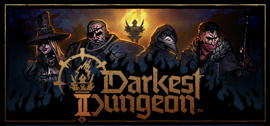

### Darkest Dungeon 2 Ultra-wide Fix + Tweaks
 

 

## Note

- Tested on Steam, 3440x1440.

## Features

- Adds the main display resolution to the list (at the bottom), highlighting should be correct.
- Forces the game to see the resolution as a "valid resolution and aspect ratio".
- Re-enables the Config button on the main screen in the top left.
- Removes Feedback/Mailinglist/Credits buttons.

## WIP

- Skip intros is work in progress. It's tied to asset loading and so on.

## Installation

- Grab the latest release of Darkest Dungeon 2 Ultra-wide Fix from [here.](https://github.com/p1xel8ted/DarkestDungeon2/releases)
- Extract the contents of the release zip in to the game directory. (e.g. "**steamapps\common\Darkest Dungeon II**" for Steam).
