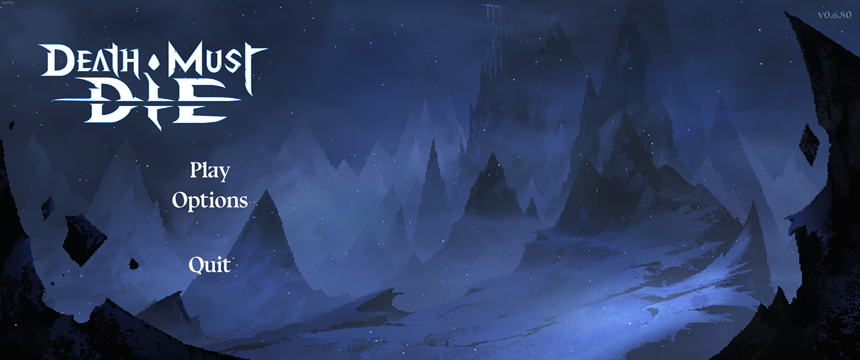
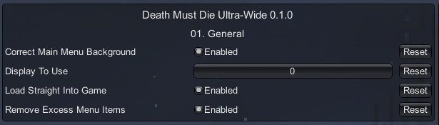

### Death Must Die Ultra-Wide

 

Tested against retail Steam version @ 3440x1440.

## Features
- Adds your main display resolution to the in-game options menu.
- Option to change what display the game uses.
- Option to correct main menu background scenery. Anything wider than 21:9 may look stretched.
- Option to remove clutter from main menu.
- Option to load directly into the game. Hold down Left-Shift while opening the game to cancel.

## Screenshots

## Configuration
- Press F1 in game to open the UI.

 

## Installation
- Grab the latest release from [here](https://github.com/p1xel8ted/UltrawideFixes/releases/tag/DeathMustDie).
- Extract the contents of the release zip into the game directory. (e.g. **`steamapps\common\Death Must Die`** for Steam on Windows).

### Steam Deck/Linux Additional Instructions
🚩**You do not need to do this if you are using Windows!**
- Open up the game properties in Steam and add `WINEDLLOVERRIDES="winmm=n,b" %command%` to the launch options.

- ## Support

   

## Credits
- [Bepis](https://github.com/bbepis) and team for [BepInEx](https://github.com/BepInEx/BepInEx).
- [ManlyMarco](https://github.com/ManlyMarco) for [ConfigurationManager](https://github.com/BepInEx/BepInEx.ConfigurationManager).
- [Sinai]() for [Unity Explorer](https://github.com/sinai-dev/UnityExplorer).
