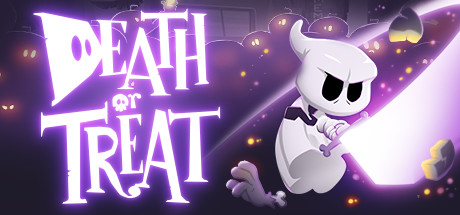

### Death or Treat Ultra-Wide Fix + Tweaks
 

 

## Note

- Tested on Steam, 21:9 and 32:9

## Features

- Changes 3840 x 2160 to your main display resolution.
- Allows customisation of the display scaling - press F1 in the game to bring up the menu and adjust the slider.
- Allows customisation of the camera zoom - press F1 in the game to bring up the menu and adjust the slider.
- Skip intros.

## Installation

- Extract the contents of the release zip into the game directory. (e.g. "**steamapps\common\Death Or Threat**" for Steam).
- Threat is not a typo...
