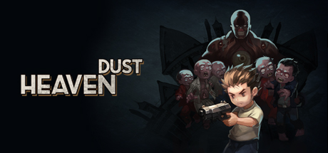
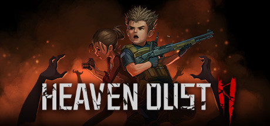

# Heaven Dust 1 & 2 Ultra-Wide Fixes + Extras

  

 

## Heaven Dust 1

* Forces resolution set in the config file. Default is your main screen resolution.
* Toggle the "dirty tv" camera overlay effect.
* Toggle vignette.
* Toggle chromatic aberration.

## Heaven Dust 2

* Forces resolution set in the config file. Default is your main screen resolution.
* Toggle the "dirty tv" camera overlay effect.
* Toggle vignette.
* Toggle chromatic aberration.
* Toggle the fog of war.
* Skip intros.

## Installation
- Extract the contents of the release zip into the game directory. (e.g. "**H:\Games\steamapps\common\Heaven Dust**" for Steam).
- Run the game once to generate a config file at **<GameDirectory>\BepInEx\config\p1xel8ted.heavendust.one.cfg**
- If installed correctly, you will see a console window pop-up.

## Configuration
- All options can be toggled on/off by setting the value to **true** or **false**.
