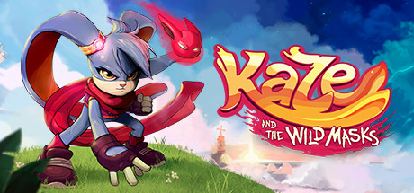

### Kaze and the Wild Masks Ultrawide Fixes

 

 

## Features
- Removes pillar boxing when using ultrawide resolutions.
- Skips developer/publisher logos.
- Corrects certain UI elements where possible for UW.

## Note
- Doesn't correct certain elements such as loading screens etc. Game play is fine.
- Tested at 3440x1440, Steam.

## Installation
- Grab the latest release of Kaze and the Wild Masks Ultra-wide Fix from [here.](https://github.com/p1xel8ted/KazeUW/releases)
- Extract the contents of the release zip in to the game directory. (e.g. "**steamapps\common\Kaze and the Wild Masks**" for Steam).
- The first run after installing BepInEx may take a little longer than usual due to the IL2CPP processing that ocurrs on the first run.

## Configuration
- None
