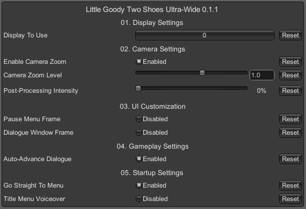

### Little Goody Two Shoes Ultra-Wide

 

 

Tested against retail Steam version @ 3440x1440.

## Features
- Makes the main display resolution the only selectable resolution.
- Forces borderless windowed mode otherwise it stretches.
- Adjustable zoom levels.
- Skip straight to the title menu (skipping the anime intro, not the splash screens - no solution for splash screens as of yet)
- Disable the voice over when the title menu loads
- Adjustable UI scale. 
- UI will span the entire width of the screen unfortunately. No solution as of yet.
- Toggle decorative frames on dialogues.
- Adjust the post-processing effect (beyond the in-game settings).
- Auto advance dialogue is on by default, and the tool menu is hidden by default.

## Configuration
- Press F1 in game to open the UI.

 

## Installation
- Grab the latest release from [here](https://github.com/p1xel8ted/UltrawideFixes/releases/tag/LittleGoodyTwoShoes).
- Extract the contents of the release zip into the game directory. (e.g. **`steamapps\common\Little Goody Two Shoes`** for Steam).

## Credits
- [Bepis](https://github.com/bbepis) and team for [BepInEx](https://github.com/BepInEx/BepInEx).
- [ManlyMarco](https://github.com/ManlyMarco) for [ConfigurationManager](https://github.com/BepInEx/BepInEx.ConfigurationManager).
- [Sinai]() for [Unity Explorer](https://github.com/sinai-dev/UnityExplorer).
- 