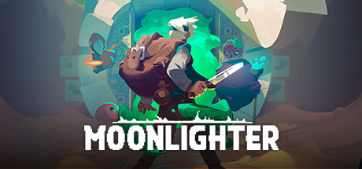

### Moonlighter Ultra-Wide Fix

 

 

## Features

- Makes your main display resolution the only one available.
- Corrects dungeon artwork - mostly. It will look average on anything wider than 21:9.

## Installation
- Grab the latest release of Moonlighter Ultra-wide Fix from [here.](https://github.com/p1xel8ted/Moonlighter/releases)
- Extract the contents of the release zip into the game directory. (e.g. "**steamapps\common\Moonlighter**" for Steam).
