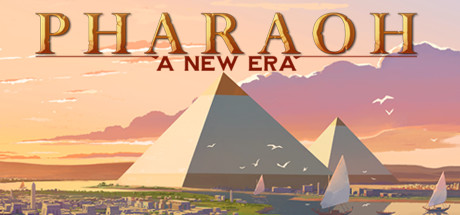

### Pharoah: A New Era Ultra-wide Fix

 

 

## Features
- Allows selection of main display resolution in the in-game resolution list.
- Removes pillarboxing and corrects UI at ultra-wide resolutions.

## Note
- Doesn't scale loading screens/main menu. Game play is fine.

## Installation
- Grab the latest release of Pharoah Ultra-wide Fix from [here.](https://github.com/p1xel8ted/Pharaoh/releases)
- Extract the contents of the release zip in to the game directory. (e.g. "**steamapps\common\Pharaoh A New Era**" for Steam).

## Configuration
- None
