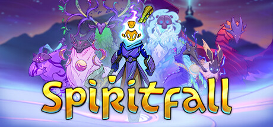

## Spiritfall Ultra-wide Fix + Tweaks

 

 

## Features
- Makes the main display resolution the only one available.
- Fixes the strange fullscreen/borderless switching behaviour (forces fullscreen borderless).
- Removes pillar-boxing.
- Skips intro.
- Options to toggle all the marketing buttons (Twitter, Discord, etc).
- Option to re-enable the 'Quit to Desktop' button in the pause menu (hidden by default).

## Configuration
- Found in "**steamapps\common\Spiritfall\BepInEx\config\p1xel8ted.spiritfall.ultrawide.cfg**" 

## Notes
- Tested with 3440x1440, Steam, Windows 11.

## Installation
- Grab the latest release of Spiritfall Ultra-Wide Fix from [here.](https://github.com/p1xel8ted/Spiritfall/releases)
- Extract the contents of the release zip into the game directory. (e.g. "**steamapps\common\Spiritfall**" for Steam).
