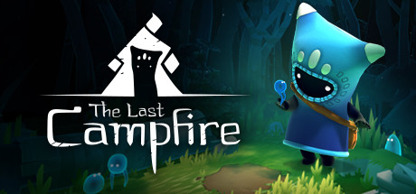

## The Last Campfire Ultra-Wide Fix

 

 

## Note
- Technically, this game works fine if you don't change your in-game resolution. If this isn't working for whatever reason, try this fix.

## Features
- Adds display resolution to the in-game configuration.

## Installation
- Extract the contents of the release zip into the game directory. (e.g. "**steamapps\common\The Last Campfire**" for Steam).
