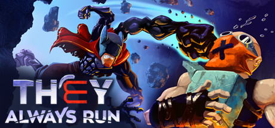

## They Always Run Ultra-Wide Fix

 

 

## Features
- Removes pillar boxing. The resolution menu is ignored.
- Corrects scaling of UI elements when using a non 16:9 resolution. The menu is still 16:9 (on purpose).
- Allows player to expand the UI or leave it at 16:9 position.
- The main game UI (player hud, health, etc) can have it's scale adjusted.
- Skip splash screens and the "press any key to start" screen.

## Preview

 

## Installation
- Grab the latest release of They Always Run Ultra-wide Fix from [here.](https://github.com/p1xel8ted/TheyAlwaysRun/releases)
- Extract the contents of the release zip in to the game directory. (e.g. "**steamapps\common\They Always Run**" for Steam).

## Configuration
- Press F1 in game to bring up the configuration menu.
- Config file can be found in "**steamapps\common\They Always Run\BepInEx\config\p1xel8ted.theyalwaysrun.ultrawide.cfg**"