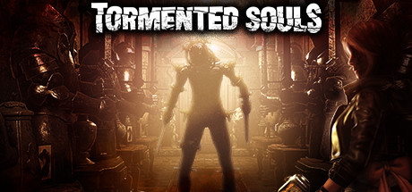

### Tormented Souls Ultra-Wide

 

 

Tested against retail Steam version @ 3440x1440 and 3840x1080.

## Features
- Adds "Ultra Wide" to the resolution menu in-game. All game languages have been included (using Google Translate....)
- Pillarboxing is automatically removed as a result of the above.
- Removes top/bottom cutscene black bars.
- UI scaling is calculated automatically and should be fine, but you can manually adjust via the F1 key.
- UI is centered at 16:9.

## Note
- If you see a scene with black bars on either side, it is one of the following:
  - A video/FMV.
  - A static background image that must be stretched to remove the bars.

## Installation
- Grab the latest release from [here](https://github.com/p1xel8ted/UltrawideFixes/releases/tag/TormentedSouls).
- Extract the contents of the release zip into the game directory. (e.g. `**steamapps\common\Tormented Souls**` for Steam).
