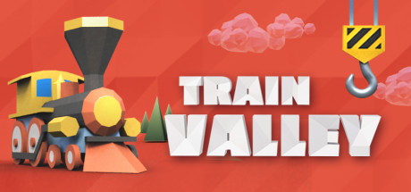

## Ultrawide fix for Train Valley.

 

 

## Features
- Removes pillarboxing and corrects UI.

## Installation
- Grab the latest release of Train Valley Ultrwide Fix from [here.](https://github.com/p1xel8ted/TrainValley/releases)
- Extract the contents of the release zip in to the game directory. (e.g. "**steamapps\common\Train Valley**" for Steam).

## Configuration
- None
