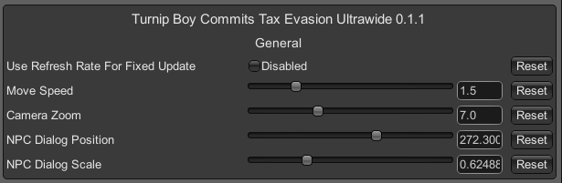

### Turnip Boy Commits Tax Evasion Ultrawide Fixes + QoL

 

 

## Features
- Allows selection of main display resolution in the in-game resolution list.
- Removes pillar boxing and corrects UI at ultra-wide resolutions.
- Option to adjust camera zoom.
- Option to adjust dialogue scale (specifically when talking to NPCs)
- Option to increase player movement speed using a multiplier.
- Zooms through developer/publisher logos.

## Configuration
- In-game UI provided by ConfigurationManager. Press F1 to open the menu and adjust settings as necessary.
   

## Installation
- Grab the latest release from [here](https://github.com/p1xel8ted/UltrawideFixes/releases/tag/TurnipBoyCommitsTaxEvasion).
- Extract the contents of the release zip into the game directory. (e.g. **`steamapps\common\Turnip Boy Commits Tax Evasion`** for Steam).

## Credits
- [Bepis](https://github.com/bbepis) and team for [BepInEx](https://github.com/BepInEx/BepInEx).
- [ManlyMarco](https://github.com/ManlyMarco) for [ConfigurationManager](https://github.com/BepInEx/BepInEx.ConfigurationManager).
- [Sinai]() for [Unity Explorer](https://github.com/sinai-dev/UnityExplorer).