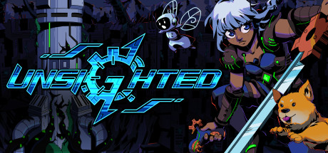

### UNSIGHTED Ultra-Wide

 

 

Tested against retail GOG & Steam version @ 3440x1440

## Features
- Resolution menu is ignored. Resolution will be the default resolution of the screen the game is on.
- Scaling and positioning of UI elements corrected where possible (transitions, menus, etc).

## Configuration
- Press F1 to open the configuration menu. Only option available is to control what screen the game is on.

## Installation
- Grab the latest release from [here](https://github.com/p1xel8ted/UltrawideFixes/releases/tag/UNSIGHTED).
- Extract the contents of the release zip into the game directory. (e.g. **`steamapps\common\UNSIGHTED`** for Steam).

## Credits
- [Bepis](https://github.com/bbepis) and team for [BepInEx](https://github.com/BepInEx/BepInEx).
- [ManlyMarco](https://github.com/ManlyMarco) for [ConfigurationManager](https://github.com/BepInEx/BepInEx.ConfigurationManager).
- [Sinai]() for [Unity Explorer](https://github.com/sinai-dev/UnityExplorer).