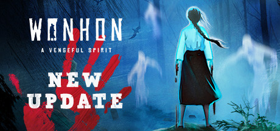

# Wonhon: A Vengeful Spirit

 

An ultra-wide fix for Wonhon A Vengeful Spirit that adds your main display resolution to the game, corrects UI at ultra-wide and above, and a few random tweaks. Uses Melon Loader.

 

## Features

* Adds main display resolution to the in-game resolution list.
* Overrides the target framerate to the highest refresh rate your screen supports.
* Adds quit to desktop button to the in-game menu.
* Corrects UI scaling at ultra-wide and above.
* Partially skips intros (work in progress).
* Tested on 3440x1440 Steam.

## Installation

- Extract the contents of the release zip into the game directory. (e.g. "**steamapps\common\Wonhon - A Vengeful Spirit**" for Steam).
- Run 'MelonLoader.Installer.exe'.
- Choose the Settings tab and enable 'Show Alpha Pre-Releases.'
- Choose the Automated tab and select version 0.6.0 from the drop-down.
- Leave Game Arch on Auto.
- Click Install

## Known Issues

- Not all intro screens are skipped.
- The resolution selector will revert to the highest 16:9 resolution (actual resolution won't change).

## Notes

- The first run of the game will take a little longer while Melon Loader works its magic, but this only happens once (or on game updates).
